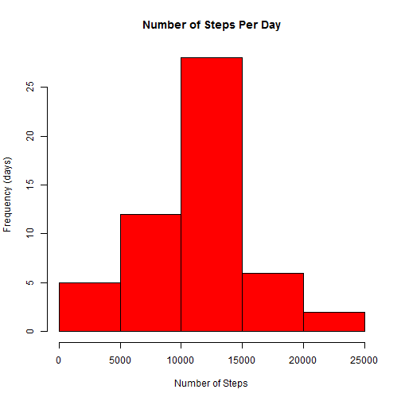
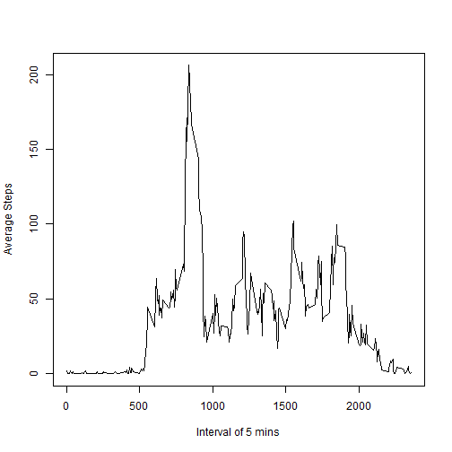
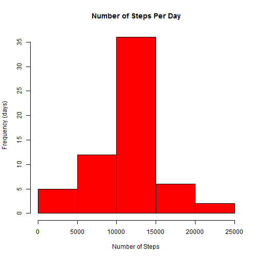
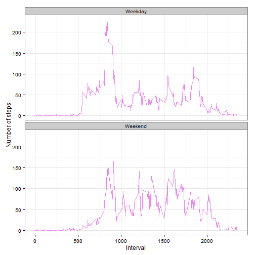

What is mean total number of steps taken per day?
---

For this part of the assignment, you can ignore the missing values in the dataset.

  1. Calculate the total number of steps taken per day

  2. If you do not understand the difference between a histogram and a barplot, research the difference between them. Make a histogram of the total number of steps taken each day

  3. Calculate and report the mean and median of the total number of steps taken per day


```r
require("ggplot2")
dataset <- read.table("activity.csv", header=TRUE, sep=",", stringsAsFactors=FALSE, dec=".")
stepsPerday<-aggregate(steps ~ date, dataset,na.rm=TRUE, FUN=sum)

## Calculate and report the mean and median of the total number of steps 
## taken per day

meanPerday<-mean(stepsPerday$steps)
meanPerday
```

```
## [1] 10766.19
```

```r
median(stepsPerday$steps,na.rm=TRUE)
```

```
## [1] 10765
```

```r
hist(as.numeric(stepsPerday$steps), main="Number of Steps Per Day", col="red",xlab="Number of Steps",ylab="Frequency (days)")
```

 
What is the average daily activity pattern?
---

  1. Make a time series plot (i.e. type = "l") of the 5-minute interval (x-axis) and the average number of steps taken, averaged across all days (y-axis)

  2. Which 5-minute interval, on average across all the days in the dataset, contains the maximum number of steps?


```r
subdata<-dataset[complete.cases(dataset),]
intervalmean<-aggregate(subdata$steps, by=list(Interval=subdata$interval), FUN=mean)

plot(intervalmean$Interval, intervalmean$x, type="l", xlab="Interval of 5 mins", ylab="Average Steps")
```

 

```r
intervalmean[which.max(intervalmean$x),]
```

```
##     Interval        x
## 104      835 206.1698
```

Imputing missing values
---

Note that there are a number of days/intervals where there are missing values (coded as NA). The presence of missing days may introduce bias into some calculations or summaries of the data.

  1. Calculate and report the total number of missing values in the dataset (i.e. the total number of rows with NAs)

  2. Devise a strategy for filling in all of the missing values in the dataset. The strategy does not need to be sophisticated. For example, you could use the mean/median for that day, or the mean for that 5-minute interval, etc.

  3. Create a new dataset that is equal to the original dataset but with the missing data filled in.

  4. Make a histogram of the total number of steps taken each day and Calculate and report the mean and median total number of steps taken per day. Do these values differ from the estimates from the first part of the assignment? What is the impact of imputing missing data on the estimates of the total daily number of steps?


```r
## Total number of NA
sum(is.na(dataset))
```

```
## [1] 2304
```

```r
## Find the intervalmean
intervalmean<- aggregate(steps ~ interval, data = dataset, FUN = mean)

## loop through the whole dataset and replace NA steps with intervalmean step
fillNA <- numeric()
for (i in 1:nrow(dataset)) {
    temp <- dataset[i, ]
    if (is.na(temp$steps)) {
        steps <- subset(intervalmean, interval == temp$interval)$steps
    } else {
        steps <- temp$steps
    }
    fillNA <- c(fillNA, steps)
}
## Create a new dataset and replace the steps values
dataset2 <-dataset
dataset2$steps <-fillNA
## Check to see if there is any NA in the new dataset
sum(is.na(dataset2)) 
```

```
## [1] 0
```

```r
## Make a histogram of the total number of steps taken each day and Calculate and 
## report the mean and median total number of steps taken per day. 

stepsPerday2<-aggregate(steps~date, dataset2, na.rm=TRUE, FUN=sum)
hist(as.numeric(stepsPerday2$steps), main="Number of Steps Per Day", col="red",xlab="Number of Steps",ylab="Frequency (days)")
```

 

```r
meanPerday2<-mean(stepsPerday2$steps)
meanPerday2
```

```
## [1] 10766.19
```

```r
median(stepsPerday2$steps,na.rm=TRUE)
```

```
## [1] 10766.19
```
The mean is the same but the median is a little bit different from those obtained in the first part of the assignment.


```r
day<-weekdays(as.Date(dataset2$date))
daylevel<- vector()
for (i in 1:nrow(dataset2)) {
     if (day[i]=="Saturday" | day[i]== "Sunday") {daylevel[i]<-"Weekend"} 
else {daylevel[i]<-"Weekday"}
}
dataset2$daylevel <-daylevel
dataset2$daylevel <-factor(dataset2$daylevel)

# Make a panel plot containing a time series plot (i.e. type = "l") of the 5-minute interval (x-axis) and 
# the average number of steps taken, averaged across all weekday days or weekend days (y-axis). 
# See the README file in the GitHub repository to see an example of what this plot should look like 
# using simulated data.

stepsmean<- aggregate(steps ~ interval + daylevel, data = dataset2, FUN = mean)
names(stepsmean) <- c("interval", "daylevel", "steps")

ggplot(stepsmean, aes(x=interval, y=steps)) + 
        geom_line(color="violet") + 
        facet_wrap(~ daylevel, nrow=2, ncol=1) +
        labs(x="Interval", y="Number of steps") +
        theme_bw()
```

 


